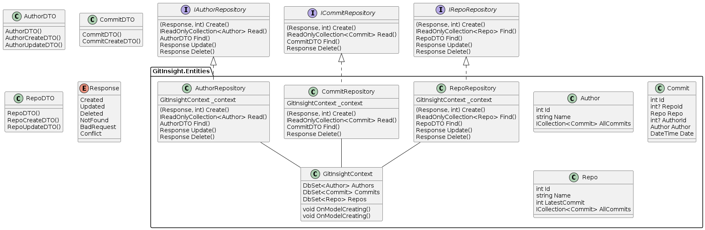

# Documentation

<!-- This is a comment, write your notes in this structure -->

## Introduction

This is a ever evolving application that facilitates analysis of git repositories.
It supports both repositories that are hosted locally and on GitHub.com.
The application exposes a WEB API, and a web page where the insights and analysis results can be accessed.

## Architecture

<!-- Describe the Architecture, both of the systems themselves, and between them -->

A Class diagram, detailing some of the the classes of the program, is shown below.
The diagram also shows one of the programs namespaces or packages.

## RESTful WEB API

The WEB API is build on REST principles, mainly supporting `GET` requests.
The API accepts a GitHub hosted repository, and returns a JSON object with the analysis results.

The analysis consists of three different parts, called Frequency, Author and Fork.
Frequency analysis describes the amount of commits that are made on a given day.
That is, the frequency of commits to the repository over time.
Author analysis, on the other hand, details the amount and distribution of commits for the different authors.

Fork analysis, uses the public GitHub API to list all direct Forks of the repository.
At the moment it only lists direct forks and not forks of forks, and so on.

The REST API exposes the analysis to the API caller, packaged in a labeled JSON object.

## Authentication and access

## Web page and illustrations

## Database

<!-- Document what the database contains, and when it is updated. 
Also write that it is an in-memory database and is not persistent -->
To start the database use command in commandline -> docker run -e "ACCEPT_EULA=Y" -e "MSSQL_SA_PASSWORD=<YourStrong@Passw0rd>" -p 1433:1433 -d mcr.microsoft.com/mssql/server:2022-latest
The database contains information about the results from the analysis, the GitHub Repository, it's commits and the authors. We use DTO's to transfer data to and from the database.

## Tests

A test suit is included with the program.
A sample git directory is included with the program tests, to facilitate testing and verification.
For testing with remote repositories, real active repos are used.
This enables easy testing, since the repositories already exists, but requires that they are not removed, made inaccessible or significantly changed.

## Quality management
